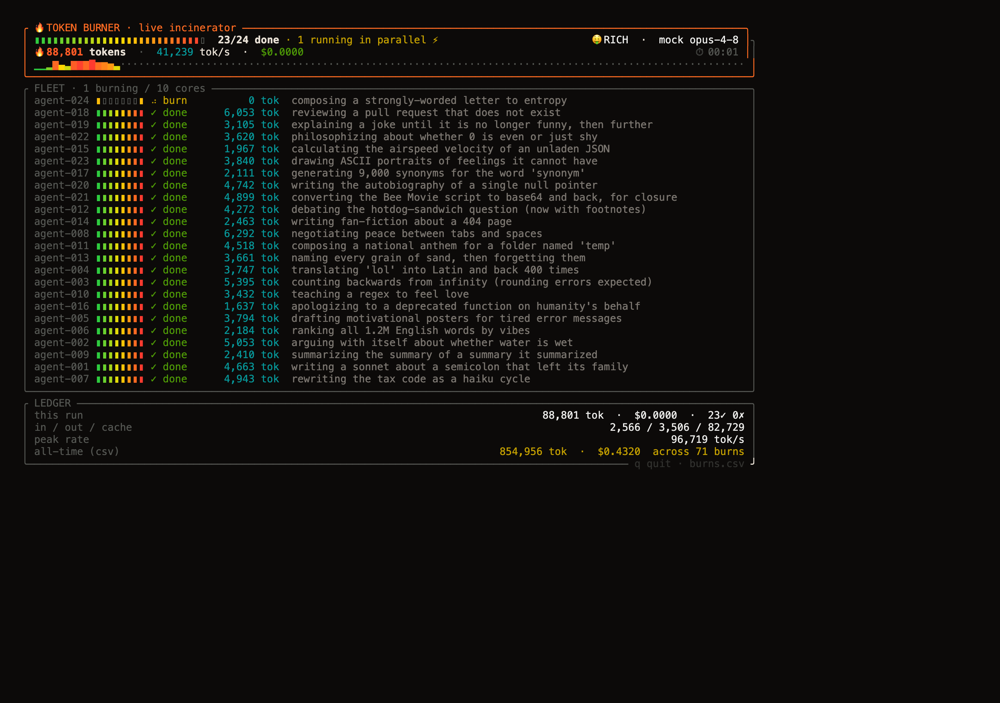
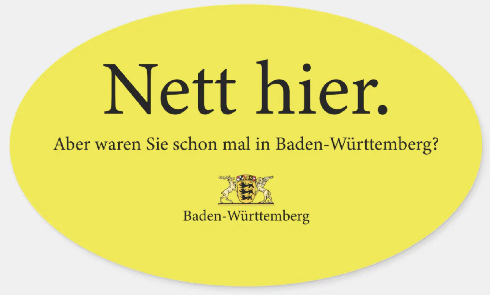

# 🔥 schwabe

> Your token limit just reset, and it expires before you'll ever use it honestly.
> The only responsible thing to do is **not to waste them.**

`schwabe` is a token burner: it spins up a fleet of real AI agents that burn
through every token you paid for — and logs every one. It runs entirely in your
terminal. Full utilization is the deliverable: nothing left on the table.

## Quick start

```bash
npm i -g schwabe   # install — puts `schwabe` on your PATH (alias: tokenburner)
schwabe            # the menu
```

`schwabe` opens a small arrow-key menu — pick what to do, pick a model, go.
Everything runs right there in your terminal (↑/↓ move · enter select · ← back · q quit).
Prefer flags? `node burn.js` takes them directly.

## What it burns on

**🔥 Burn** — each agent gets one magnificently over-the-top task (a sonnet about a
runaway semicolon, an argument over whether water is wet, release notes for the
heat death of the universe…) and commits fully.

**🌲 Offset your consumption** (`--forest`) — each agent "plants" an ASCII tree
into a growing `FOREST.txt`, and we tally the **virtual CO₂ savings** (using real
per-species sequestration rates) against the very real CO₂ we just emitted
burning the tokens. Certified carbon-negative™. (It is not.)

## node burn.js — the flags

```bash
node burn.js                                # burn, default tier (rich/opus) — spends real money
node burn.js --forest --schwabe --count 25  # 5×5 forest on haiku (cheap)
node burn.js --dry                          # mock backend — same UI, ZERO spend (safe preview)
node burn.js --plain                        # headless line output (no full-screen TUI)
```

| flag | meaning | default |
|------|---------|---------|
| `--forest` | plant a virtual forest instead of burning text | off |
| `--schwabe` / `--student` / `--rich` | budget tier → haiku / sonnet / opus | `--rich` |
| `--mode <tier>` · `--model <id>` | same, long form · override the model | from tier |
| `--count N` (alias `--fleet`) | how many agents in total | ∞ (endless) |
| `--concurrency N` (alias `--parallel`) | how many run at once (~1 GB RAM each) | `6` |
| `--unlimited` | open the floodgates (as many as your RAM survives) | off |
| `--backend <name>` | `claude` · `gemini` · `codex` · `mock` | `claude` |
| `--dry` | mock backend, no spend | off |
| `--plain` | headless renderer | auto (non-TTY) |
| `--no-retry` | give up instead of waiting out rate limits | off |
| `--share <platform>` | print a brag link after the receipt | off |

> ⚠️ `node burn.js` with no flags spends **real** tokens on opus. Watch it free
> first with `node burn.js --dry`.

The live dashboard is btop-style — heat-graded progress, per-agent spinners, a
tokens/sec graph, and a running LEDGER with lifetime totals. Colors auto-adapt to
a light or dark terminal. Press `q` to bail.

<p align="center">
  
</p>

## It logs everything, and survives running dry

Every agent is recorded to **`burns.csv`** (metrics) and **`ashes.jsonl`** (the
output), with lifetime totals carried across runs. Hit a rate / budget limit
mid-burn and the fleet **waits and keeps retrying** until it clears, then resumes
— `--no-retry` opts out.

## Brag (optional, off by default)

```bash
node share.js x              # prints a prefilled tweet link from your last burn
```

`share.js` reconstructs your most recent run from the ledger and hands you a
**prefilled** share link — it never opens a browser, you press the button —
behind a quick "heads up before you post" confirmation. `--yes` skips it.

## Bonus: the Claude Code fleet

Inside Claude Code, `/burn [N]` runs a parallel swarm of agents and forges the
funniest wreckage into [`HALL_OF_FLAME.md`](HALL_OF_FLAME.md).

## How it's built

Clean, dependency-free, ESM. Add a burn engine or a share platform by dropping one
spec file into `lib/backends/` or `lib/integrations/` — both share one tiny
`lib/core/registry.js`. Every module is unit-tested with Node's built-in runner and
**zero test dependencies**: `npm test`.

```
burn.js              entry: fleet → live dashboard → receipt
launcher.js          the `schwabe` menu (alias: tokenburner)
lib/core/            util · config (flags + MODES tiers) · registry (name→spec)
lib/backends/        claude · gemini · codex · mock  (registry + factory)
lib/engine/          fleet · retry · metrics · tasks · prompts · ledger
lib/forest/          the ASCII forest + real per-species CO₂ data
lib/ui/              tui.js (btop) · plain.js (headless) · widgets.js
lib/integrations/    brag/share platforms (prints links; never opens a browser)
test/                node:test unit suite (npm test) — no test deps
```

Every `lib/` entry is a domain directory — no loose files — and every module
is unit-tested.

## Why this repo exists — die schwäbische Doktrin 🪙

This whole thing is built for the Schwabe.

If you've never met one: a Schwabe is from **Baden-Württemberg**, the part of
Germany known for not spending money.\* He doesn't throw out food, doesn't leave
the lights on, and will circle the block for twenty minutes to dodge a parking
fee. *Sunk cost* isn't a fallacy to him, it's just not a concept he accepts.
Paid for it? Then you use all of it, **bis auf den letzten Token.**

Now think about your token limit. You paid for it, it resets on a timer, and any
tokens you didn't use are simply gone when the window closes. Most people don't
notice. A Schwabe can't think about anything else. Owning something and not
using it physically hurts.

Now the real nightmare: the tank refills **two days before** the plan expires.
Fresh tokens, already paid for, on a countdown. A normal person shrugs and uses
what they need. The Schwabe clears his calendar. He burns day and night —
breakfast, lunch, 3 a.m. — feeding the fleet until every last token is spent,
because letting them expire unused is simply not something he can live with.

That's what `schwabe` is for. You sit down, burn through every token you're
owed, and hit a clean **100%** with a clear conscience. It was never about the
output. *Nichts verschwendet.*

And for the *Green Schwabe* — the one who drives a 1,000 hp, 3-tonne, "AA++"
hybrid SUV basically a bicycle — there's `--forest` option. Plant a
whole virtual forest to offset the emissions. It cancels out about as much CO₂ the tokens cost you, but the conscience stays spotless.

<p align="center">
  
</p>

---

<sub>\* The one time a Schwabe spends all his money at once is buying a **house**.
And the moment he signs, he bumps up the loan so he can also drive home a
**Mercedes**, then spends the next 40 years paying both back. Sparsamkeit is a
long game.</sub>

## License

WTFPL. Do what the fire wants.
